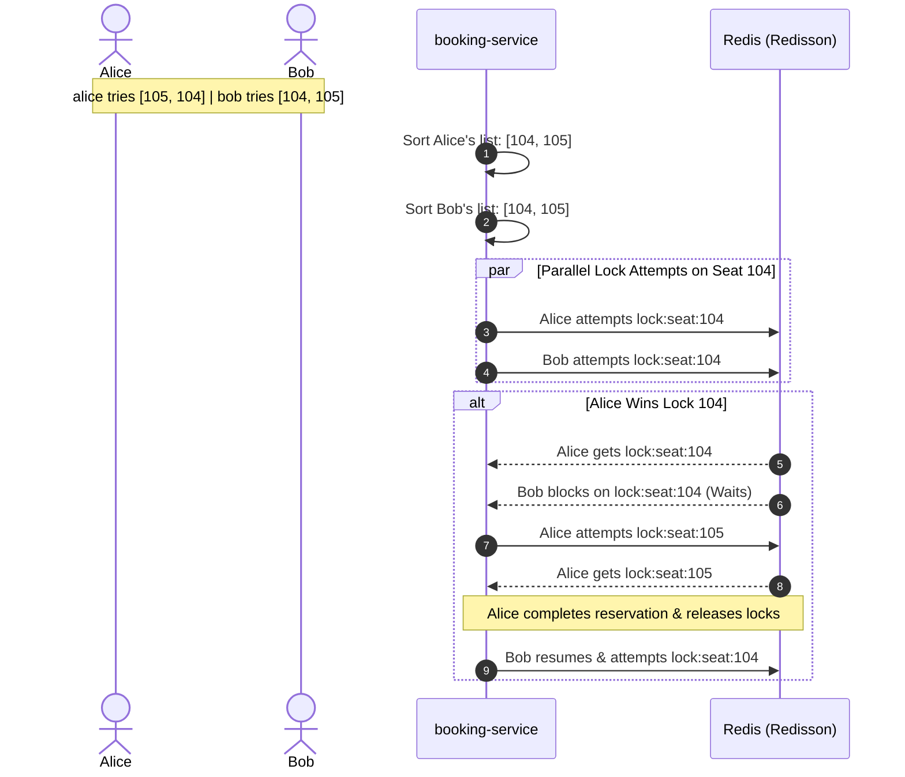

# TicketCraft

TicketCraft is a high-concurrency ticket booking engine and distributed systems simulator modeled after Ticketmaster. The platform is designed to simulate flash-sale ticket distributions for major events (e.g., a 130,000+ capacity stadium concert) under heavy concurrent load while maintaining strict transactional consistency, zero double-booking, and sub-millisecond query latencies.

---

## 🏗️ System Architecture & Tech Stack

This platform is structured as a Java Spring Boot microservices cluster running inside Docker containers:

* **API Gateway (`gateway-service`)**: Spring Cloud Gateway. Handles routing, rate-limiting (Redis Token Bucket), and JWT authentication propagation.
* **Service Discovery (`eureka-server`)**: Eureka Server for dynamic registry and heartbeat-based instance health monitoring.
* **Lobby Queue (`queue-service`)**: Spring WebFlux & Redis ZSET. Prevents microservice thread pool exhaustion by routing excess requests to a virtual waiting room.
* **Catalog API (`catalog-service`)**: PostgreSQL Full-Text Search (GIN indices), Geospatial coordinates, and gRPC Seat Checking.
* **Booking Engine (`booking-service`)**: Redisson (Redis locks) to handle multi-seat transactions synchronously, and Server-Sent Events (SSE) for real-time seat map state synchronization.
* **Payment Worker (`payment-service`)**: Consumes Kafka events asynchronously to run simulated billing checkouts.

---

## ⚡ Core Technical Solutions & Design Decisions

### 1. Lock Ordering to Prevent Distributed Deadlocks
When users reserve multiple seats simultaneously (e.g., Alice requests seats `[104, 105]` while Bob requests `[105, 104]` at the exact same millisecond), acquiring distributed locks in arbitrary orders leads to cyclic wait conditions (deadlocks).
* **The Solution**: The `booking-service` **sorts the target seat IDs numerically** prior to requesting locks. Enforcing a strict, global lock acquisition order across all threads converts potential deadlocks into predictable, serialized wait sequences.



---

### 2. Waitlist Position Update Scalability (Decoupled SSE Ranks)
Broadcasting queue position updates to 100,000 waiting users every time *one* user is promoted creates an $O(N \cdot M)$ network congestion pattern (where $N$ is waitlist size and $M$ is promotion rate), saturating network interfaces (NICs).
* **The Solution**: Instead of event-triggered broadcasts, we implement a **decoupled interval-based push**. Each open SSE connection in the `queue-service` runs a task **every 5 seconds** that performs a fast $O(\log N)$ `ZRANK` check against the Redis Sorted Set (`ZSET`) waitlist. This flat lines network bandwidth and scales predictably with waitlist size.

---

### 3. Session Security Split: CSRF Block vs. Stateful Revocation
To secure microservice communications statelessly without sacrificing the ability to revoke user sessions, we split token lifetimes and storage:
* **JS Memory (Access Token)**: The short-lived `accessToken` is stored in JS memory (React state) and passed via the `Authorization: Bearer` header. This completely blocks **CSRF (Cross-Site Request Forgery)** since malicious sites cannot access the JS memory space.
* **HttpOnly Cookies (Refresh Token)**: The long-lived `refreshToken` is stored in an `HttpOnly`, `Secure`, `SameSite=Strict` cookie. When a user closes or refreshes their browser tab (destroying the JS memory state), the application calls `POST /api/auth/refresh`. The browser automatically transmits the cookie, which the Gateway validates against a Redis whitelist to issue a new access token.

---

### 4. Database Connection Multiplexing with PgBouncer
Under flash-sale surges, Tomcat's thread-pool can easily spawn hundreds of threads. Allocating a physical PostgreSQL connection to every thread quickly hits the OS fork limit and causes severe connection context-switching bottlenecks in PostgreSQL.
* **The Solution**: We configure **PgBouncer transaction-level pooling**. Application connections are decoupled from physical database connections. PgBouncer multiplexes thousands of active application connections over a compact pool of 50 physical PostgreSQL connections, releasing database sockets the microsecond a transaction commits.

---

### 5. Asynchronous Payment Offloading with DLQ Recovery
Processing external payment API calls (e.g., Stripe) takes 1–3 seconds. Holding database connections and locks open for this duration would exhaust our pool and crash the booking engine under load.
* **The Solution**: The booking engine writes a `PENDING` transaction to the database, releases all database locks/connections, and publishes a `BookingCreatedEvent` to Apache Kafka. The payment service consumes the event asynchronously, calls the payment API, and broadcasts a `PaymentProcessedEvent`. If a payment call fails due to transient network errors, a **Dead Letter Queue (DLQ)** with exponential backoff handles retries, ensuring eventual consistency.

---

### 6. Double Precision vs. Decimal String Serialization in gRPC
gRPC services communicate over HTTP/2 using Protocol Buffers. However, Protobuf lacks a native decimal type, and mapping currency to `double` or `float` fields introduces binary representation rounding errors (IEEE 754 precision issues).
* **The Solution**: Prices and money values are explicitly transmitted as a **`string`** in `.proto` files (e.g., `"150.00"`). This protects the transaction stream from rounding errors during serialization/deserialization. The receiving client safe-casts the string directly back into a Java `BigDecimal`.

---

## 🚀 Getting Started

### Prerequisites
* Java 21
* Maven 3.8+
* Docker & Docker Compose

### Running Locally
1. Clone the repository:
   ```bash
   git clone git@github.com:arduR-O/ticketcraft.git
   cd ticketcraft
   ```
2. Spin up the infrastructure containers (PostgreSQL, Redis, Kafka, Zipkin):
   ```bash
   docker compose up -d
   ```
3. Build the project and generate the gRPC stubs:
   ```bash
   mvn clean install
   ```
4. Run all microservices or launch them from your favorite IDE.
