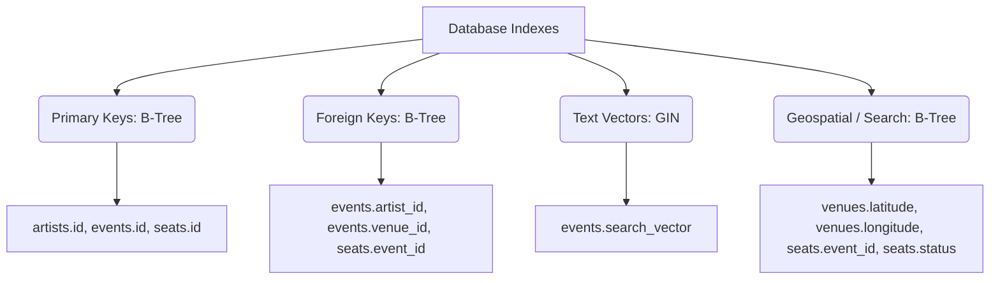

# TicketCraft

TicketCraft is a high-concurrency ticket booking engine and distributed systems simulator modeled after Ticketmaster. The project is designed to simulate flash-sale ticket distributions for major events (e.g., a 132,000 capacity stadium concert) under heavy traffic while maintaining strict transactional guarantees and sub-millisecond query latencies.

---

## 🏗️ System Architecture & Tech Stack

This platform is structured as a Java Spring Boot microservices cluster running inside Docker containers:

* **API Gateway (`gateway-service`)**: Spring Cloud Gateway. Handles routing, rate-limiting (Redis Token Bucket), and JWT authentication propagation.
* **Service Discovery (`eureka-server`)**: Eureka Server for dynamic registry and heartbeat-based instance health monitoring.
* **Lobby Queue (`queue-service`)**: Spring WebFlux & Redis ZSET. Prevents microservice thread pool exhaustion by routing excess requests to a virtual waiting room.
* **Catalog API (`catalog-service`)**: PostgreSQL Full-Text Search (GIN indices), Geospatial coordinates, and gRPC Seat Checking.
* **Booking Engine (`booking-service`)**: Redisson (Redis locks) to handle multi-seat transactions synchronously, and Server-Sent Events (SSE) for real-time seat map state synchronization.
* **Payment Worker (`payment-service`)**: Consumes Kafka events asynchronously to run simulated billing checkouts.

---

## ⚡ Core Technical Solutions & Design Decisions

### 1. Database Indexing Blueprint & Concurrency Trade-Offs

When mapping a high-traffic relational database (PostgreSQL), we prioritized B-Tree and GIN indexes over array denormalization on the parent tables:

#### The Trade-Off: Denormalized Arrays vs. Normalized B-Tree Indexes
Our database normalized structure uses **foreign keys** (`artist_id`, `venue_id`) rather than storing arrays of event IDs directly inside the `artists` table (e.g., `artists.event_ids = [101, 102, 103]`). 

* **Lock Contention**: Denormalized arrays require acquiring a **Write Lock** on the parent `Artist` row every time a new concert is created, creating a severe database bottleneck when multiple admin threads update schedules concurrently.
* **Referential Integrity**: PostgreSQL cannot enforce foreign key constraints on elements inside an array. Normalized foreign keys ensure the database engine maintains strict referential safety natively.
* **Latency**: A logarithmic B-Tree lookup on `events(artist_id)` resolves queries in sub-millisecond execution times, matching the read performance of arrays without the write contention.



#### Our Index Design:
| Table | Column(s) | Index Type | Query Target |
| :--- | :--- | :--- | :--- |
| `events` | `search_vector` | **GIN (Generalized Inverted Index)** | Full-Text search queries (e.g. typing partial artist/venue names). |
| `events` | `artist_id` | **B-Tree** | Look up concerts by specific artists. |
| `events` | `venue_id` | **B-Tree** | Look up events scheduled at specific stadiums. |
| `events` | `date` | **B-Tree** | Retrieve upcoming events sorted chronologically. |
| `events` | `(artist_id, date)` | **Composite B-Tree** | Retrieve upcoming events for a specific artist. |
| `seats` | `(event_id, status)` | **Composite B-Tree** | Instant $O(1)$ lookups for active, purchaseable (`'AVAILABLE'`) seats. |
| `venues` | `(latitude, longitude)` | **B-Tree** | Supports fast geographic bounding-box checks for "Events Near Me". |

---

### 2. Geospatial Architecture: Flat Lat/Lon vs. PostGIS
To show users events near their current location, we mapped coordinates (`latitude`, `longitude` as `Double`) to our `venues` table.
* **Haversine Formula**: We calculate distance using the Haversine formula directly in SQL native queries combined with a bounding-box filter.
* **The Decision**: We opted for standard `Double` fields over the heavy PostGIS spatial extension to maintain a **portable local footprint** (enabling standard H2 in-memory databases to execute tests without third-party C-bindings or custom Docker image requirements).

---

### 3. Asynchronous & Multi-Seat Reservation Security
* **Deadlock Prevention**: Before holding any Redis distributed locks via Redisson, the system **sorts the requested seat IDs numerically**. This ensures that multiple concurrent threads trying to book overlapping seats acquire locks in the exact same order, preventing cyclic wait conditions (deadlocks).
* **Virtual Thread Scalability**: By enabling virtual threads (`spring.threads.virtual.enabled: true`), Spring Boot Tomcat unmounts Carrier Threads from OS threads the instant a blocking DB transaction begins. This allows the Catalog and Booking services to support thousands of concurrent bookings without running out of operating system threads.

---

### 4. gRPC vs. REST for Internal Microservices
Communication between the `booking-service` and the `catalog-service` is handled over **gRPC (HTTP/2 + Protocol Buffers)** instead of REST (HTTP/1.1 + JSON):
* **CPU Efficiency**: Protobuf encodes data as a compressed binary stream, eliminating the heavy string parsing and reflection overhead associated with JSON.
* **TCP Multiplexing**: HTTP/2 multiplexes thousands of requests over a single open TCP connection, eliminating the TCP handshake overhead and socket-limit bottlenecks of HTTP/1.1.
* **Precision Monies**: Monies and seat prices are mapped as a **`string`** in the `.proto` schema instead of `double` or `float` fields. This protects the billing pipeline from binary floating-point representation rounding errors (preserving strict `BigDecimal` precision over network jumps).
* **Java EE Workaround**: Addressed legacy `@javax.annotation.Generated` dependencies in gRPC generated compiler stubs under Java 21 by adding `javax.annotation-api` directly to the classpath.

---

## 🚀 Getting Started

### Prerequisites
* Java 21
* Maven 3.8+
* Docker & Docker Compose

### Running Locally
1. Clone the repository:
   ```bash
   git clone git@github.com:arduR-O/ticketcraft.git
   cd ticketcraft
   ```
2. Spin up the infrastructure containers (PostgreSQL, Redis, Kafka, Zipkin):
   ```bash
   docker compose up -d
   ```
3. Build the project and generate the gRPC stubs:
   ```bash
   mvn clean install
   ```
4. Run all microservices or launch them from your favorite IDE.
